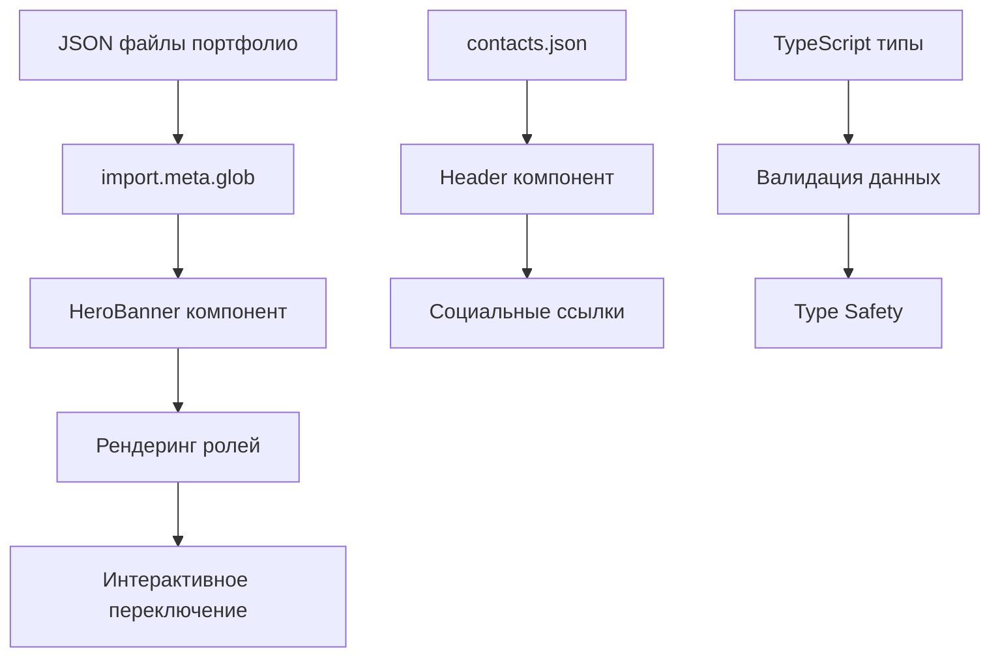

# Архитектура проекта

## Обзор

Проект представляет собой статический сайт-портфолио, построенный на Astro с использованием современного стека технологий. Архитектура спроектирована для максимальной производительности, переиспользования кода и простоты поддержки.

## Принципы архитектуры

- **Компонентный подход** - переиспользуемые Astro компоненты
- **Типизация** - TypeScript для безопасности типов
- **Модульность** - разделение логики и представления
- **Производительность** - статическая генерация и оптимизация
- **Масштабируемость** - легкое добавление новых ролей и функций

## Структура файлов

```
src/
├── components/          # UI компоненты
│   ├── Header.astro    # Навигационная панель
│   ├── HeroBanner.astro # Главный баннер с переключением ролей
│   └── Welcome.astro   # Приветственный блок
├── data/               # Данные приложения
│   ├── contacts.json   # Контактная информация
│   └── portfolios/     # JSON файлы портфолио
│       ├── react-developer.json
│       ├── frontend-developer.json
│       └── python-developer.json
├── layouts/            # Шаблоны страниц
│   └── Layout.astro    # Базовый HTML шаблон
├── pages/              # Маршруты приложения
│   └── index.astro     # Главная страница
├── styles/             # Стили и темы
│   ├── colors.scss     # CSS переменные и цветовая палитра
│   ├── reset.css       # Сброс браузерных стилей
│   └── page-container.css # Утилитарные классы
└── types/              # TypeScript определения
    └── TypePortfolio.ts # Интерфейсы для портфолио
```

## Ключевые компоненты

### Layout.astro
Базовый шаблон, который:
- Определяет HTML структуру
- Подключает глобальные стили
- Включает Header компонент
- Предоставляет слот для контента страниц

### HeroBanner.astro
Центральный компонент, который:
- Отображает информацию о разработчике
- Реализует переключение между ролями
- Управляет интерактивными элементами
- Содержит социальные ссылки

### Header.astro
Навигационный компонент с:
- Адаптивным меню
- Эффектом прокрутки
- Hover анимациями

## Поток данных



## Система стилей

### CSS переменные
Централизованное управление цветами через `colors.scss`:
```scss
:root {
    --color-azure: #00bfff;        // Основной акцентный цвет
    --color-azure-light: #63d8ff;  // Светлый оттенок
    --color-black: rgb(17, 17, 17); // Основной темный цвет
    // ... другие переменные
}
```

### Методология
- **BEM** для именования классов
- **SCSS** для препроцессинга
- **CSS Grid/Flexbox** для верстки
- **Mobile-first** подход

## Интерактивность

### JavaScript функциональность
- Переключение ролей в HeroBanner
- Эффект прокрутки для Header
- Hover анимации
- Клик вне области для закрытия меню

### Анимации
- CSS transitions для плавных переходов
- Transform для трансформаций
- Grid template rows для раскрытия меню

## Производительность

### Оптимизации Astro
- Статическая генерация
- Минификация HTML/CSS/JS
- Tree-shaking неиспользуемого кода
- Оптимизация изображений

### Загрузка ресурсов
- Lazy loading для изображений
- Preconnect для шрифтов
- Минимальный JavaScript

## Масштабируемость

### Добавление новых ролей
1. Создать JSON файл в `portfolios/`
2. Типы автоматически подхватываются
3. UI обновляется без изменений кода

### Расширение функциональности
- Новые компоненты в `components/`
- Дополнительные страницы в `pages/`
- Стили в соответствующих SCSS файлах

## Безопасность

- Нет серверной логики
- Статический контент
- Валидация данных через TypeScript
- Безопасные внешние ссылки (rel="noopener noreferrer")
